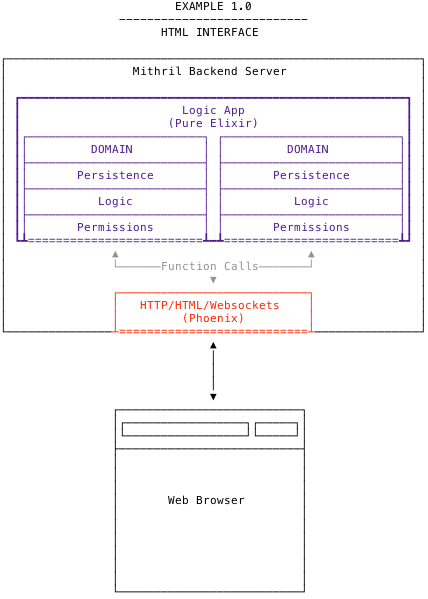
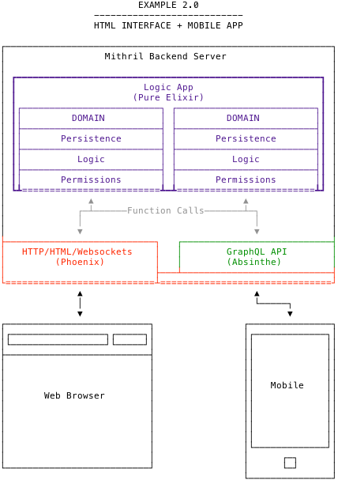
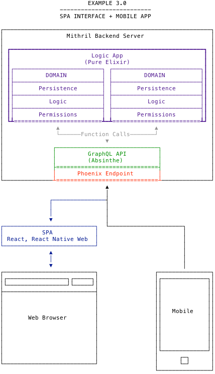
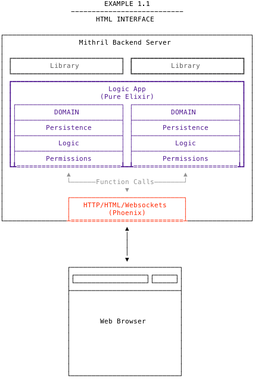
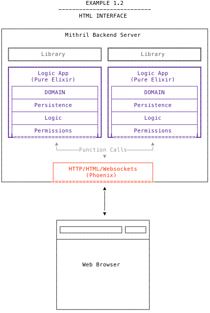

# Conventions

Mithril applications follow the following conventions.

## Project Structure

Mithril applications are Elixir [Umbrella](https://elixir-lang.org/getting-started/mix-otp/dependencies-and-umbrella-apps.html#umbrella-projects)
apps. The code is organized into several [OTP apps](https://elixir-lang.org/getting-started/mix-otp/supervisor-and-application.html#understanding-applications)
in the `apps/` directory.


```bash
my_app/
├── README.md
├── apps
│   ├── my_app     # Business logic ("Domains"), persistence
│   └── my_app_api # GraphQL API
│   └── my_app_web # Phoenix Endpoint
├── bin
│   ├── reset      # Resets and rebuilds the project
│   ├── setup      # Sets up all dependencies
│   ├── test       # Runs tests like they would run on CI
│   └── update     # Updates the project (for mobile devs)
├── config
├── mix.exs
└── mix.lock
```

Each app has specific, isolated responsibilities.

- `my_app` A pure Elixir app which handles **logic** and **persistence**, with 
  few dependencies.
- `my_app_api` [Client] The API for the project. (Usually GraphQL) Calls into 
  `my_app`'s logic.
- `my_app_web` [Client] Tiny Phoenix app which mounts the API and calls into 
  `my_app`'s logic.

## Domains

Within `my_app`, logic is divided between _domains_. Each domain contains the 
logic to support a specific feature or group of _closely-related_ features.

For example, you might have an `Accounts` domain to handle user registration,
forgot password, and login. Such a domain would have the following structure:

```bash
lib
└── my_app
    └── accounts         # Each domain gets a folder in lib/
        ├── accounts.ex  # MyApp.Accounts module providing the public interface
        └── user.ex      # Ecto schema representing a user
```

The `accounts/accounts.ex` file defines `MyApp.Accounts`, which is the public
interface for this domain. It is important to document this module well, 
including [typespecs](https://elixir-lang.org/getting-started/typespecs-and-behaviours.html).

```elixir
defmodule MyApp.Accounts do
  @moduledoc """
  Describe what this domain is for...
  """

  @doc """
  Document the create_user function...
  """
  @spec create_user(map) :: 
    {:ok, MyApp.Accounts.User.t} | 
    {:error, Ecto.Changeset.t}
  def create_user(params) do
    # create a user here
  end
end
```

Domains can contain other internal modules, but _**only the public interface can
be called from outside the domain**_. This gives the domain complete flexibility
on its internals going forward.

- Each domain handles its own persistence _internally_.
- Domains may call other domains' public interfaces. But _be careful_:
  - Carefully consider whether the domains should be separate
  - Document the relationship between the two domains

## Client Applications

`my_app_api` and `my_app_web` are considered _client applications_ of `my_app`.
They exist solely to give `my_app` the ability to speak HTTP or GraphQL or
whatever other protocol `my_app` needs to speak to the outside world.

Think of these apps as _translators_. In human language, the concepts, 
ideas and actions that we communicate are the same; the language we speak is just
a protocol for communicating those things.

Likewise, `my_app` contains the concepts and actions, and these client 
applications act as translators for those concepts and actions for a protocol
like HTTP or GraphQL.

There are two rules of thumb with regard to client applications:

1. **Translator Only**. They must only _wrap_ `my_app`. All business logic concerns
   must be handled by `my_app`, with the client app only providing translation.

2. **Client Only**. `my_app` must be unaware of the client app's existence, and not
   rely on a client app to do anything but translate.

## Libraries

The `apps/` directory is a perfect incubator for new Elixir libraries. If a piece
of logic or client application code could be reused in other projects, it can make
sense to extract that code to a library in `apps/`.

```bash
$ cd apps/
$ mix new my_library
```

You can then copy code over to `apps/my_library` and update the dependencies of the
apps that rely on it:

```elixir
def deps do
  [
    {:my_library, in_umbrella: true}
  ]
end
```

When the library is mature, it should be extracted to its own repository and published
to Hex. Then, all you'll need to do is update your deps again:

```elixir
def deps do
  [
    {:my_library, ">= 0.0.0"}
  ]
end
```

## Why These Conventions?

Mithril's core idea is to **decouple logic from protocol concerns**. This idea
was originally spearheaded by the Phoenix core team in Phoenix 1.3, and
Mithril aims to explain and demonstrate how to actually do it. 

Mithril decouples your logic application from your client (protocol) applications.
This decoupling allows Mithril servers to have both:

- A flexible client architecture
- A flexible backend architecture

### Flexible Client Architecture

Because the logic is decoupled from the protocol and client interface, you
can easily layer any protocol or interface on top of the same logic core. This
greatly increases the scalability and lifetime of the server.

Any of the following architectures (and more) can easily be built on top of
a Mithril logic app.

#### 1. Server-Rendered HTML

The Phoenix app renders the HTML interface by calling into the logic app.



#### 2. Server-Rendered HTML + Mobile

An application with a server-rendered HTML interface _and_ a mobile application. 
To support the mobile application, we simply add an API app to handle GraphQL, 
and plug it into our existing Phoenix app.

The new GraphQL app calls into the same logic app functions that the Phoenix app 
uses to render the HTML interface, ensuring that both protocols behave consistently.



#### 3. SPA + Mobile

An application with a React single-page interface, and a mobile application. In 
this case, the Phoenix app only exists to mount our GraphQL API.

The SPA code could be hosted separately or served by Phoenix, depending on your
preferences.



### Flexible Backend Architecture

The backend of a Mithril application is also flexible. Let's take the server-rendered
HTML example above and look at how it might scale over time, with small refactorings.

#### Version 1.0

In version 1.0, the app consists of two OTP apps: a logic app and a Phoenix app.


#### Version 1.1

In version 1.1, we extract parts of the domains to their own library OTP apps in the
apps/ directory, either for reuse in other projects or to make the logic application
more focused.

Nothing changes from the perspective of the Phoenix app: it calls the same domains
as before and knows nothing about the refactor.



#### Version 1.2

In version 1.2, we break up the logic application into multiple smaller applications.
Each major domain becomes its own OTP app, with its own dependencies.

The Phoenix app continues to call into the new apps, with only minor refactoring
needed to point it at the right app.



#### Version 1.3

In version 1.3, we break up the umbrella application and host the OTP apps independently
on separate hardware. Very little needs to change, because Elixir OTP apps can call each
other over the network in much the same way that they can call each other on the same
machine.

!> You may have to switch hosting providers in order to give all your
   servers network access to each other.


#### Conclusion

At each step along the way, no logic had to be rewritten. The logic remained
the same, despite major changes to the client interface and backend architecture.
This is why Mithril conventions offer so much value: a backend built with them will
be very flexible and therefore long-lived.

Business owners want long-lived backend servers. They never want to rewrite, and they're
tired of hearing that they should from each new developer they hire.
Likewise, developers are tired of working on "legacy" backends which don't scale well
and are hard to work with.

With Mithril's conventions, we can align the interests of both developers and business 
owners to provide effective software that is also good value for money.